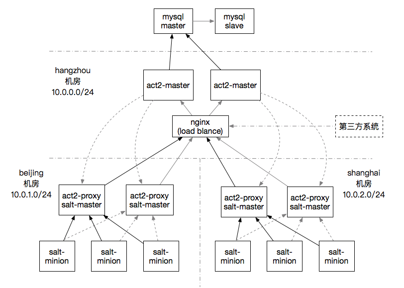

# 部署架构

​	

​Cloud-Act2 Master 部署在最上层，统一管理所有的 Cloud-Act2 Proxy 节点，并可以收集 Cloud-Act2 Proxy 上报的主机信息到数据库中。

​Cloud-Act2 Proxy 部署在各个逻辑 `IDC` 机房，同时需要部署 Salt-Master，推荐 SaltStack 版本为 2018.3.3，通过 Salt-Master 接收被管理服务器上 Salt-Minion 收集到的信息，然后 Salt-Master 的信息将会被 Cloud-Act2 Proxy 收集，再将其上报给 Cloud-Act2 Master。

收集的主机，使用主机的序列号来表示主机的唯一性，我们称为 `entity id`


逻辑 `IDC` 机房：以 Cloud-Act2 Proxy 为单位进行划分的，依据部署架构，同一个逻辑机房下的机器，连接到同一个 Salt-Master，而 Salt-Master 和 Cloud-Act2 Proxy 是部署在同一台机器上的。


## 端口

- SaltStack Minion：4505/4506
- SaltStack Master: 4505/4506
- Cloud-Act2 Master: 6868
- Cloud-Act2 Proxy: 5555


## Entity id 的获取

### linux

```bash
cat /sys/class/dmi/id/product_uuid
```


### windows

```bat
wmic csproduct get uuid
```