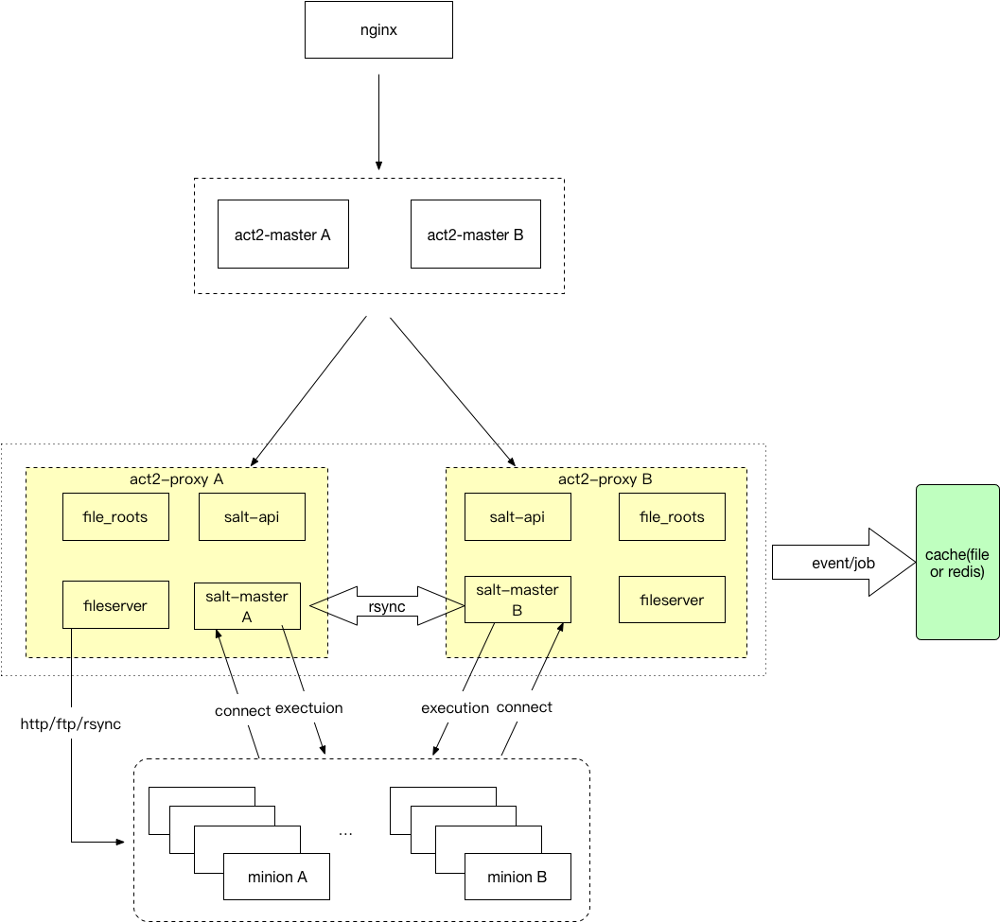

# 整体架构

​Cloud-Act2 产品中的组件主要为 Cloud-Act2 Master(下图的 act2-master 部分) 和 Cloud-Act2 Proxy(下图的 act2-proxy 部分），Cloud-Act2 Proxy 分布于各机房，Cloud-Act2 Master 通过管理各机房的 Cloud-Act2 Proxy 来实现对各机房服务器的管理。

用户可在 Cloud-Act2 上，构建自己的统一运维管理平台。

​

​Cloud-Act2 Master：负责作业的调度分发，主机收集，ACL 访问控制功能。收集 Cloud-Act2 Proxy 采集的设备信息、执行结果信息，并将其保存到数据库中。

​Cloud-Act2 Proxy：接收 Cloud-Act2 Master 下发的指令，然后将指令转发给底层执行通道（SaltStack、SSH）执行。采集被管理的服务器信息和执行结果信息，并上报给 Cloud-Act2 Master。

