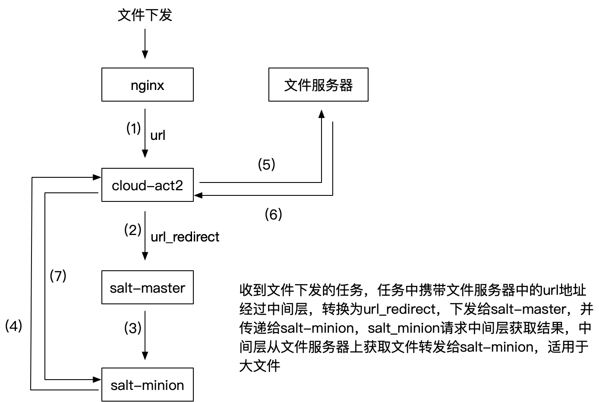
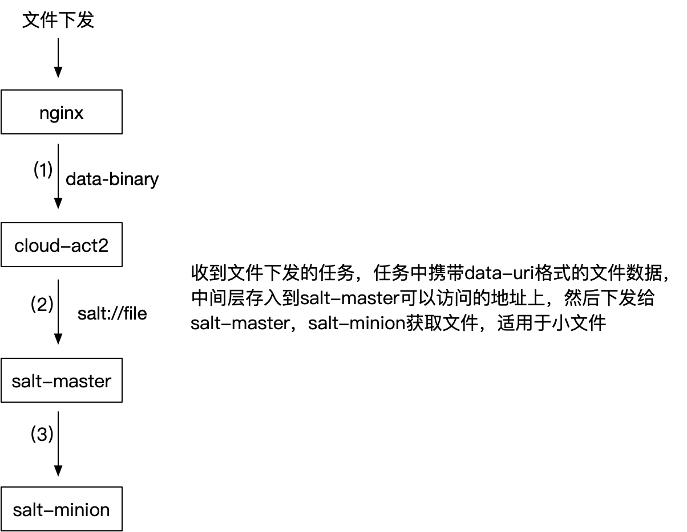

# 文件下发

文件下发有两种形式，一种是通过 url 方式下发，一种是通过传递文本形式下发，其调用结构如下：

## 通过 url redirect 方式下发文件

注：cloud-act2-master 必须要能够访问到文件服务器

## 通过 data uri scheme 方式下发文件

采用这种方式时，cloud-act2 master 会被认为是个文件服务

关于 data uri scheme 的介绍见 [wiki](https://en.wikipedia.org/wiki/Data_URI_scheme) 和 [MDN](https://developer.mozilla.org/en-US/docs/Web/HTTP/Basics_of_HTTP/Data_URIs)

