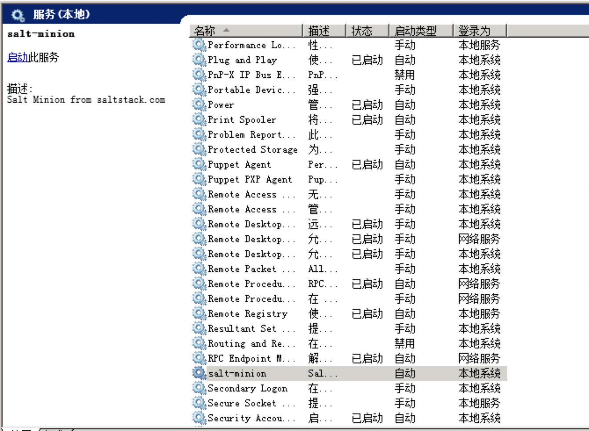

### 在 Windows 2008 R2 上安装 Salt-Minion


### 下载

X86(32 位机器）下载：https://repo.saltstack.com/windows/Salt-Minion-2018.3.3-Py2-x86-Setup.exe

Amd64（64 位机器）下载：https://repo.saltstack.com/windows/Salt-Minion-2018.3.3-Py2-AMD64-Setup.exe


### 获取 id 信息

按下 `win+r` 键，输入 `cmd` ，打开终端：

```bat
wmic csproduct get uuid
```

将输出的 id 记录下来，下面用 $id 表示


### 安装

先确定 `salt-master` 的地址，下面假设是 `192.168.1.17`，在终端下执行

```bat
Salt-Minion-2018.3.3-Py2-AMD64-Setup.exe /S /master=192.168.1.17 /minion-name=$id
```

将上面的 `192.168.1.17` 替换你实际的 master 地址，将 `$id` 替换你实际的 id


### 启动服务

按下 `win+r` 键，输入 `services.msc`，打开服务窗口，找到下图所示的项:




点击`启动`即可


### 其他

在其他 `Windows` 系统上安装类似上面步骤


#### 参考

[1] https://repo.saltstack.com/#windows

